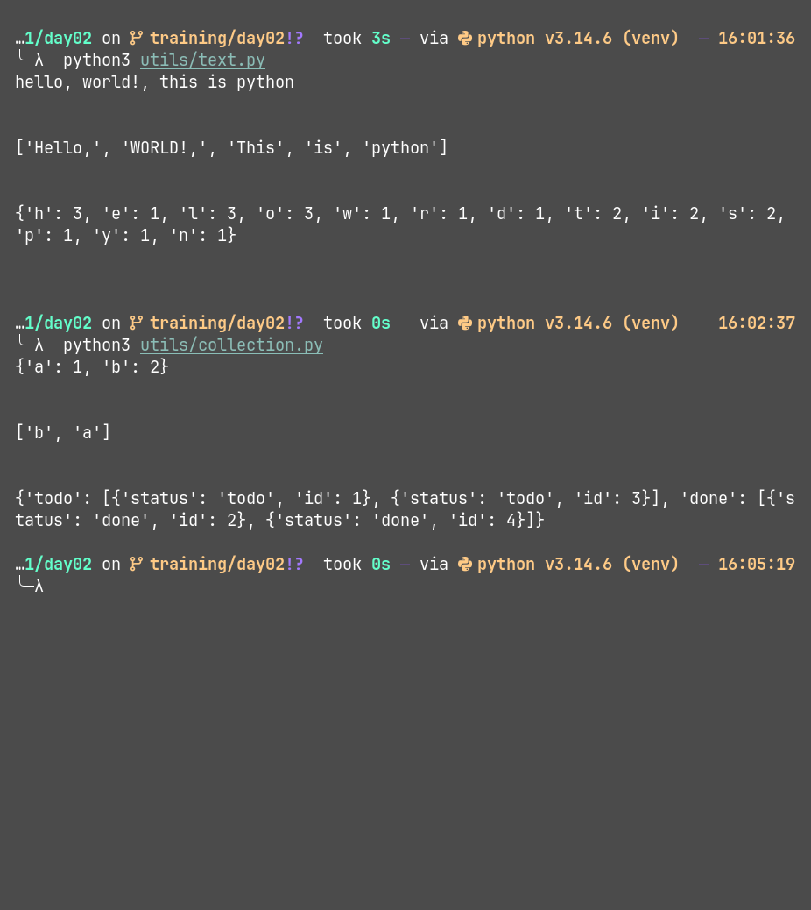

### steps to setup and run isort,black and pylint locally

1. create a virtual environment using command 'python -m venv venv'
2. activate the virtual environment

- Command Prompt: (CMD).\venv\Scripts\activate.batGit
- Bash: /WSLsource venv/Scripts/activate
- Linux(fish shell): source /bin/activate.fish

3. install isort,black and pylint using pip

- pip install pylint,isort,black

4. setup config files for pylint

- create .pylintrc
  Basic config:

```

[MASTER]
ignore-paths=^(._/)?venv/._

[FORMAT]
max-line-length = 88

```

for more options [visit docs](https://pylint.readthedocs.io/en/stable/)

5. create pyproject.toml for black

Basic config:

```
[tool.black]
line-length = 88
target-version = ['py310','py311','py312','py313','py314']
include = '\.pyi?$'
force-exclude = '''
\.eggs
| \.git
| \.hg
| \.mypy_cache
| \.tox
| \.venv
| _build
| buck-out
| build
| dist
'''

```

for more options [visit docs](https://black.readthedocs.io/en/stable/)

6. create .isort.cfg

Basic:

```
[settings]
profile = black

```

for more options [visit docs](https://isort.readthedocs.io/en/latest/)

5. To run the tools use the following commands in terminal

- pylint **/*/py
- black .
- isort .

### snapshots


