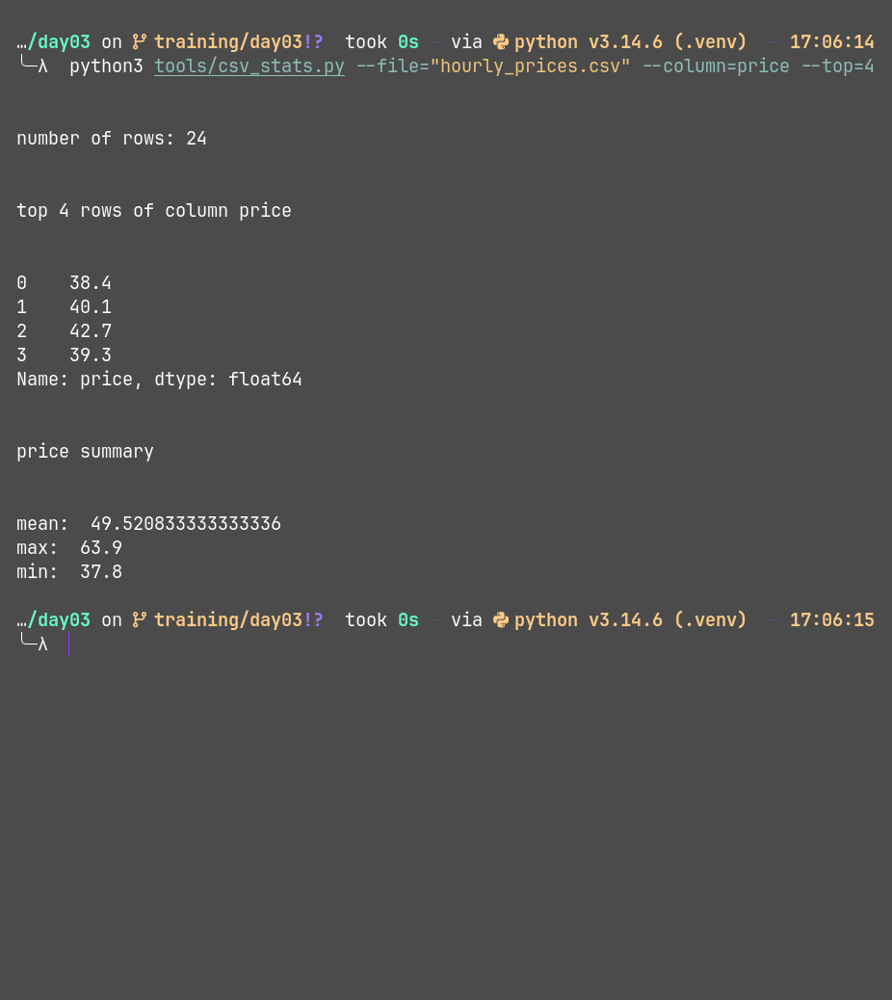
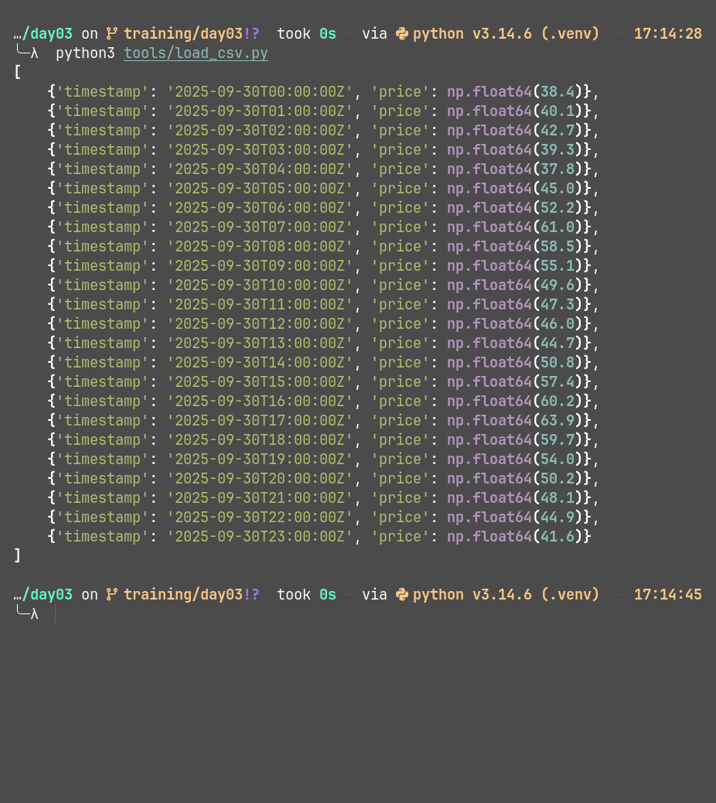
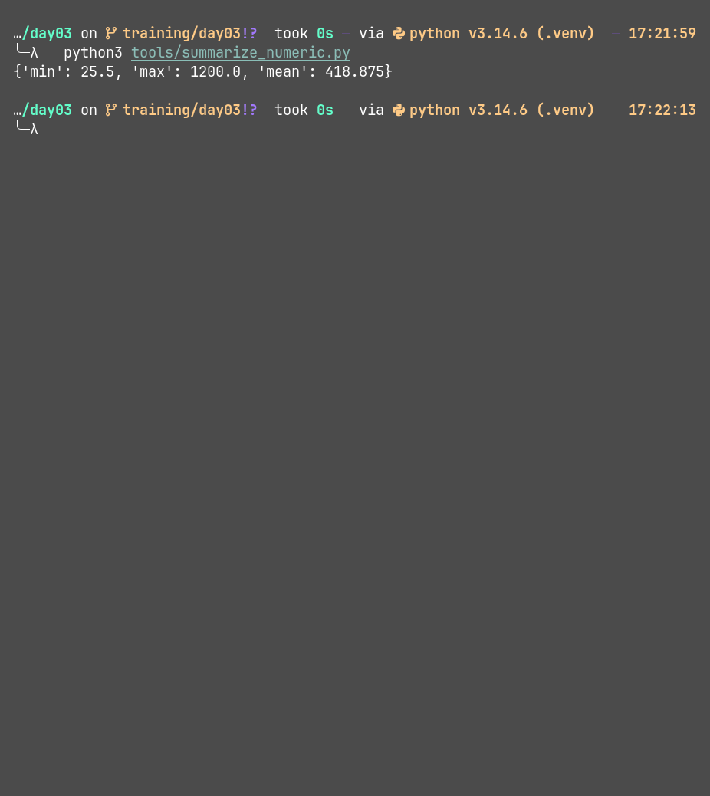

#### DataFrame and csv handler

A set of tools to handle and perform some basic operations on a dataframe or csv file

## Tools

- **CSV stats cli**: A cli tool which gives basic stats of a csv file
  Arguments of cli
  - --file: name of the file to be analyzed (not optional)
  - --top: for view only top n files,by default it will return all the rows (type:int, optional)
  - --column: name of the column to be analyzed (not optional)

  use case:
  - put your csv file in the directory: intern_training/data/energy/hourly_prices.csv
  - python3 tools/csv_stats.py --file="hourly_prices.csv" --column=price --top=4

  result:
  

- **load_csv**: A python module which takes a csv file path as parametere and returns a list of dictionary
  result:

  ```python
    print(load_csv("../../data/energy/hourly_prices.csv"))
  ```

  

- **summerize_numeric**:A python module to to give a basic summary of a given list of dictionaries based on column name
  sample result:

```python

  print(
      summarize_numeric(
          rows=[
              {"name": "Laptop", "price": "1200.00", "category": "Electronics"},
              {"name": "Mouse", "price": "25.50", "category": "Electronics"},
              {"name": "Desk", "price": "300.00", "category": "Furniture"},
              {"name": "Chair", "price": "150.00", "category": "Furniture"},
          ],
          column="price",
      )
  )

```



- **top_n**: A python module to sort the given top n rows in descending order

  sample result:

```python

print(
    top_n(
        [
            {"name": "Laptop", "price": "1200.00", "category": "Electronics"},
            {"name": "Mouse", "price": "25.50", "category": "Electronics"},
            {"name": "Desk", "price": "300.00", "category": "Furniture"},
            {"name": "Chair", "price": "150.00", "category": "Furniture"},
        ],
        column="price",
        n=5,
    )
)

```


## Tech stack

- python >= 3.12

### Installation

```bash

git clone [https://github.com/s0ur4bhkumar/training.git]

cd training/intern_training/week01/day03

source .venv/bin/activate # for mac and linux
source .venv/bin/activate.bat #for windows

pip install isort black pylint pandas rich

```
